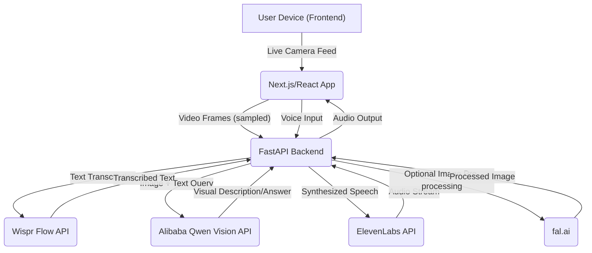

# VoxSight: Technical Blueprint and Implementation Guide

## 1. Detailed Description

**VoxSight** is an innovative, real-time accessibility co-pilot designed to empower individuals with visual impairments. It functions as an AI agent that processes live visual input from a camera (simulating a wearable device) and provides immediate, context-aware auditory feedback. The user can also interact with VoxSight via voice commands, asking questions about their surroundings. This creates a dynamic, conversational interface that translates visual information into actionable audio guidance.

The core innovation lies in its ability to orchestrate multiple advanced AI services to deliver a seamless, low-latency experience crucial for real-time assistance. Unlike traditional object recognition systems, VoxSight aims for rich, contextual descriptions and interactive dialogue, making it a truly intelligent companion.

## 2. Technical Architecture

VoxSight employs a client-server architecture, leveraging modern web technologies for the frontend and a robust, performant backend for AI orchestration.

### Frontend (Client-Side - Next.js/React)

*   **User Interface:** A minimalist web interface (accessible via mobile browser) for camera feed display (optional, primarily for debugging/visualization), microphone input, and audio output.
*   **Camera Access:** Captures live video frames from the device's camera.
*   **Microphone Access:** Records user voice commands.
*   **Audio Playback:** Plays back the synthesized voice responses from the backend.
*   **WebSockets:** Establishes a persistent, low-latency connection with the FastAPI backend for real-time data exchange (video frames, voice input, audio output).

### Backend (Server-Side - FastAPI)

*   **API Gateway:** Exposes RESTful endpoints for initial setup and WebSocket endpoints for real-time communication.
*   **Frame Processing:** Receives video frames from the frontend. Implements logic to intelligently sample frames (e.g., on voice command, or at a reduced rate) to optimize API calls and minimize latency.
*   **Voice-to-Text Module:** Integrates with **Wispr Flow** to transcribe user voice commands into text.
*   **Multimodal AI Orchestrator:** The core intelligence layer.
    *   Receives transcribed text and (optionally) visual context (image frames).
    *   Utilizes **Alibaba Qwen (Vision)** to analyze the image frames and generate detailed descriptions or answer specific questions based on the visual input and textual query.
    *   Formulates a natural language response.
*   **Text-to-Speech Module:** Integrates with **ElevenLabs** to synthesize the natural language response into high-quality, empathetic speech.
*   **Audio Streaming:** Streams the synthesized audio back to the frontend via WebSocket.
*   **fal.ai Integration (Optional but Recommended):** For very fast image pre-processing (e.g., super-resolution, noise reduction) before sending to Qwen, or for alternative fast generative inference if Qwen's vision API has latency issues.

### Data Flow Diagram

## 3. Tech Stack

| Component | Technology | Rationale |
| :--- | :--- | :--- |
| **Frontend** | Next.js (React) + TailwindCSS + shadcn/ui | Rapid development, mobile-first, excellent for interactive UIs. Tailwind/shadcn for quick, polished styling. |
| **Backend** | FastAPI (Python) | High performance, asynchronous capabilities, excellent for API orchestration and integrating multiple AI services. |
| **Real-time Comm.** | WebSockets (via FastAPI and browser API) | Essential for low-latency streaming of video frames and audio responses. |
| **AI Vision** | Alibaba Qwen (Vision API) | Multimodal understanding, strong performance in visual description and reasoning. |
| **Voice Synthesis** | ElevenLabs API | High-quality, natural-sounding speech generation with emotional nuance. |
| **Speech-to-Text** | Wispr Flow API | Accurate and fast transcription of spoken user queries. |
| **Fast Inference** | fal.ai | Optional, but provides a safety net for extremely fast image processing or alternative generative models if needed. |
| **Deployment** | Netlify (Frontend), Render/Railway (Backend) | Simple, fast deployment for hackathon projects. |
| **IDE** | Cursor | Your primary development environment, leveraging its AI capabilities. |

## 4. Leveraging Claude Code Subscription

Your Claude Code subscription will be a massive accelerator. For each API integration (Wispr Flow, Alibaba Qwen, ElevenLabs), you can use Claude Code to:

*   **Generate API Client Code:** Provide the API documentation (or even just the API name and desired function) and ask Claude Code to generate the Python client code for making requests, handling authentication, and parsing responses. This saves hours of manual coding.
*   **Boilerplate Generation:** Ask Claude Code to generate the basic Next.js component structure for webcam/microphone access, or the FastAPI endpoint definitions.
*   **Debugging:** If you encounter issues, paste error messages or code snippets into Claude Code for quick debugging suggestions.
*   **Prompt Engineering:** Use Claude Code to refine your Qwen prompts for better visual understanding and response generation. Experiment with different phrasings to get the most accurate and helpful descriptions.

By automating these coding tasks, you can focus your limited hackathon time on the core logic, orchestration, and the crucial demo experience.

## 5. Step-by-Step 5-Hour Build Plan

This plan is optimized for a solo or duo team, assuming pre-event setup (API keys, basic repo scaffold, Netlify/Render configured).

### Phase 1: Frontend Core & Camera (11:00 - 12:00)

*   **11:00 - 11:30 (30 min):** Set up Next.js project with TailwindCSS and shadcn/ui. Create a basic page with a video element for camera feed and a button to start/stop. Implement React hooks for `getUserMedia` to access the webcam. Display the live camera feed.
    *   *Claude Code Assist:* Ask for Next.js boilerplate with Tailwind and webcam access component.
*   **11:30 - 12:00 (30 min):** Implement a mechanism to capture frames from the video stream (e.g., using a canvas element to draw frames at a set interval or on demand). Focus on getting a single frame as a base64 encoded image or blob.
    *   *Claude Code Assist:* Ask for a React component that captures a frame from a video stream to a canvas and converts it to base64.

### Phase 2: Backend & Qwen Vision Integration (12:00 - 13:30)

*   **12:00 - 12:30 (30 min):** Set up FastAPI backend. Create a WebSocket endpoint to receive image frames from the frontend. Implement a basic endpoint to test image reception.
    *   *Claude Code Assist:* Ask for a basic FastAPI app with a WebSocket endpoint that receives base64 images.
*   **12:30 - 13:30 (60 min):** Integrate Alibaba Qwen Vision API. Send captured image frames to Qwen with a default prompt like "Describe this image in detail." Parse Qwen's response and send it back to the frontend via WebSocket. Display the text response on the frontend.
    *   *Claude Code Assist:* Ask for Python client code for Alibaba Qwen Vision API, including authentication and image sending. Ask for a FastAPI endpoint that calls this client and returns the description.

### Phase 3: Voice Input & Output (13:30 - 15:00)

*   **13:30 - 14:00 (30 min):** Implement microphone access on the frontend. Use a library or native browser API to record short audio snippets (e.g., on button press or voice activity detection). Send these audio snippets to the backend via WebSocket.
    *   *Claude Code Assist:* Ask for a React component that records microphone audio and sends it as a blob via WebSocket.
*   **14:00 - 14:30 (30 min):** Integrate Wispr Flow API on the backend. Receive audio snippets, send them to Wispr Flow for transcription, and log the transcribed text.
    *   *Claude Code Assist:* Ask for Python client code for Wispr Flow API, including authentication and audio sending.
*   **14:30 - 15:00 (30 min):** Integrate ElevenLabs API on the backend. Take Qwen's text response, send it to ElevenLabs for speech synthesis, and stream the resulting audio back to the frontend via WebSocket. Play the audio on the frontend.
    *   *Claude Code Assist:* Ask for Python client code for ElevenLabs API, including authentication and text-to-speech. Ask for a FastAPI endpoint that streams audio back.

### Phase 4: Orchestration & Refinement (15:00 - 16:30)

*   **15:00 - 15:30 (30 min):** Connect the dots. When a user speaks, trigger Wispr Flow. Use the transcribed text to formulate a more specific prompt for Qwen (e.g., "Based on this image, answer: [user's question]"). Send the image and the new prompt to Qwen. Synthesize Qwen's response with ElevenLabs. Implement a 
simple UI for displaying the transcribed question and the spoken answer.
    *   *Claude Code Assist:* Ask for Python logic to dynamically construct Qwen prompts based on user input.
*   **15:30 - 16:00 (30 min):** Implement the 
core "blindfold" demo logic: when a voice command is detected, capture a frame, send it to Qwen with the transcribed question, get the response, synthesize with ElevenLabs, and play it back. Focus on low latency.
    *   *Claude Code Assist:* Ask for a FastAPI function that orchestrates Wispr, Qwen, and ElevenLabs in sequence.
*   **16:00 - 16:30 (30 min):** Final polish, error handling, and Netlify/Render deployment check. Ensure the demo flow is smooth and robust. Add a simple loading indicator or status messages to the UI.

### Phase 5: Demo Preparation (16:30 - 17:30)

*   **16:30 - 17:00 (30 min):** Practice the demo repeatedly. Identify potential failure points. Have a backup plan (e.g., pre-recorded audio for a specific scenario if live TTS fails). Ensure the blindfold works and you can operate the interface by feel.
*   **17:00 - 17:30 (30 min):** Prepare your pitch. Focus on the problem, the "wow" moment, and how VoxSight uses the sponsor tools. Emphasize the social impact and your unique background in multimodal AI.

## 6. References

[1] Cursor Hackathon Dublin. Luma. URL: https://luma.com/cursordublin?tk=BpMCOd
[2] HeyGen API Pricing. HeyGen. URL: https://www.heygen.com/api-pricing
[3] ElevenLabs Blog. ElevenLabs. URL: https://elevenlabs.io/blog/announcing-the-winners-of-the-elevenlabs-worldwide-hackathon
[4] Exa AI. Exa.ai. URL: https://exa.ai/
[5] Alibaba Cloud Qwen. Alibaba Cloud. URL: https://www.alibabacloud.com/en/solutions/generative-ai/qwen?_p_lc=1
[6] fal.ai. fal.ai. URL: https://fal.ai/
[7] Wispr Flow. Wispr Flow. URL: https://wispr.ai/flow
